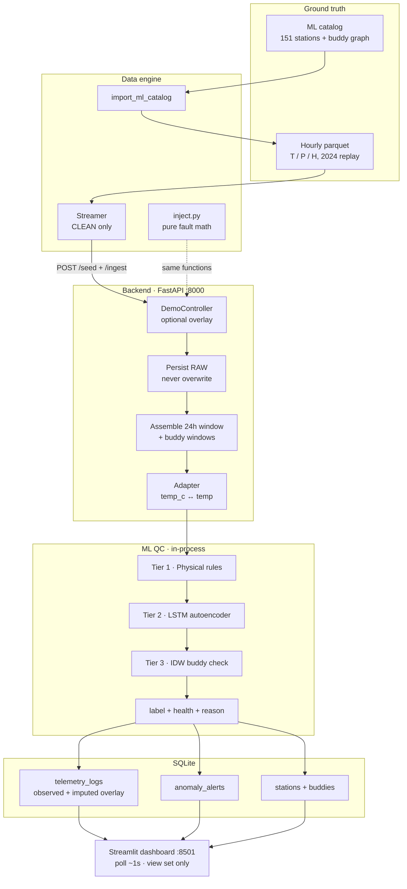
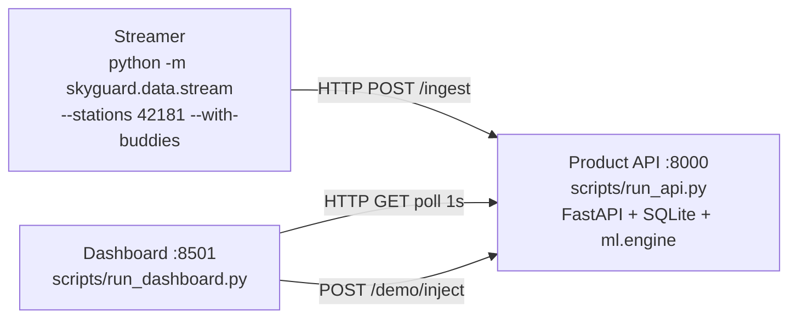
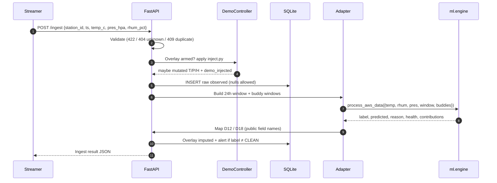
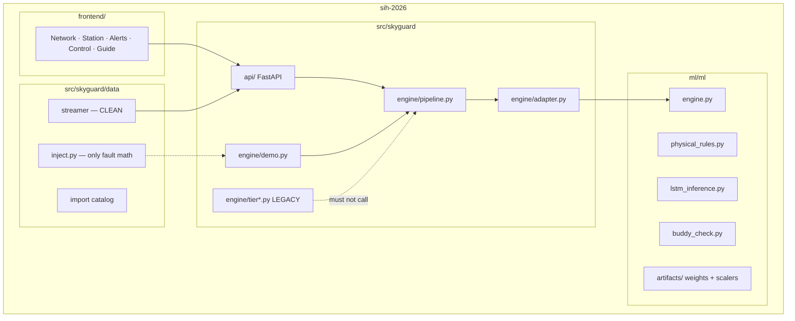
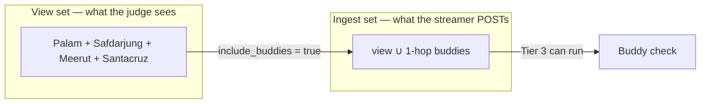
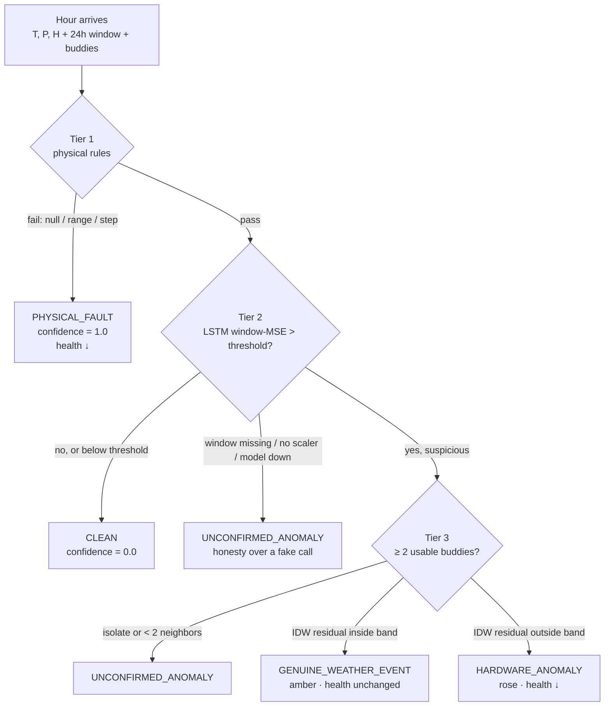

# SkyGuard AI — Product Requirements Document

**SIH 2026 · Problem Statement 26073**  
**Audience:** PPT / pitch team (also usable as a judge brief)  
**Status:** Shipped end-to-end. This document describes the **live product**, not a wishlist.  
**Last updated:** 2026-09-10

This file is self-contained. Internal engineering contracts still live in [`contracts.md`](contracts.md). Do not invent API fields, labels, or station lists for slides — copy from here.

---

## 0. How to use this document

| If you are making… | Start at | Steal these |
|---|---|---|
| Title + problem slides | §1–2 | One-liner, official example, why min/max fails |
| Architecture slides | §4–5 | Diagrams A–E (Mermaid — paste into [mermaid.live](https://mermaid.live) or export SVG) |
| “How the AI works” slides | §6 | Three-tier QC, decision tree, LSTM sketch |
| Demo / judge story slides | §8, §11 | Palam storm vs Palam spike, 30-second script |
| UI screenshots + captions | §9 | Five pages, color tokens, marker legend |
| Q&A / appendix | §12–14 | What we are **not**, glossary, locked decisions |

**Pitch spine (one sentence per slide):**

1. AWS networks fail silently; min/max cannot tell a storm from a broken sensor.
2. SkyGuard QC sits in front of the network and reads **only T, P, H**.
3. Three tiers: physical rules → LSTM autoencoder → spatial buddy check.
4. Neighbors agree → weather (amber). Neighbors disagree → hardware (rose).
5. Raw readings are never overwritten; the model writes an overlay + a reason sentence.
6. Live demo: storm around Palam vs break Palam temperature.
7. 151 trained Indian stations; Delhi does not validate Mumbai.

---

## 1. One-liner and product promise

**SkyGuard AI is a real-time quality-control service for Indian Automatic Weather Stations.** It takes hourly **temperature, pressure, and humidity only**, and for every hour it answers:

1. Is this hour trustworthy?
2. If not — is it a **real weather event** or a **broken / drifting / silent sensor**?
3. How confident are we, and **which channel** caused the call?
4. What would the value have been (reconstruction overlay)?
5. Is this station healthy enough to keep in the operational network (7-day health)?

**Grand challenge (problem statement):** a self-aware, self-healing weather network that stays trustworthy under all conditions.

**Official SIH example:** one station reports 55 °C and wild humidity/pressure while neighbors are normal → **hardware anomaly**, not a heatwave.

**What a judge should remember:** SkyGuard does not “predict weather.” It **trusts or distrusts an observation**, and it refuses to call a lone spike a cyclone just because the number is extreme.

---

## 2. Problem

### 2.1 What goes wrong in the field

Automatic Weather Stations (AWS) stream temperature (°C), pressure (hPa), and relative humidity (%). Those streams go bad for boring, operational reasons:

| Failure | What the data looks like | Why a human would miss it |
|---|---|---|
| **Spike** | One hour jumps many σ on one channel | Looks like a microburst / sensor glitch |
| **Freeze** | Same value for many hours | Looks like “stable weather” |
| **Drift** | Slow bias over 1–2 days | Min/max still “in range” |
| **Comms drop** | Null / missing packet | Gap, not a number |
| **Physical breach** | 99 °C, RH 120 %, pressure 600 hPa | Easy — but rare |
| **Genuine storm** | T down, P down, H up **together**, **and** neighbors do the same | Looks identical to a multi-channel fault **if you only look at one station** |

### 2.2 Why simple rules fail

A min/max gate (`T ∈ [−10, 60]`) will:

- **Miss** slow calibration drift (still inside the band).
- **Miss** a frozen sensor reporting a plausible 28.4 °C for 18 hours.
- **False-alarm** a real heatwave or monsoon cell if the threshold is tight.
- **Cannot** distinguish “Palam is 48 °C and Safdarjung is 29 °C” from “all of NCR is 48 °C.”

Spatial context is the missing piece. A reading is only a hardware fault if **this station disagrees with the weather its neighbors are actually having**.

### 2.3 Constraint that makes this hard

The product is allowed **only three channels: T, P, H.** No wind, no radar, no satellite, no SYNOP present-weather code. The model must invent trust from a 24-hour local window plus a **buddy graph** of nearby stations that were trained together.

---

## 3. Scope

### 3.1 In scope (what we built)

| Package | Role | What it owns |
|---|---|---|
| **Data engine / simulator** | Replay India’s AWS hours | Catalog import, clean parquet, labeled eval, accelerated HTTP stream |
| **Backend (product shell)** | FastAPI + SQLite | Persist raw, apply demo faults, assemble windows, call ML, serve query APIs |
| **ML QC engine** (`ml/`) | Production detector | Physical rules + LSTM autoencoder + IDW buddy check + 7-day health |
| **Frontend** | Five-page light Streamlit console | Map, overlays, alerts, inject buttons, guide — **polls REST only** |

### 3.2 Out of scope (do not put on slides as if we shipped them)

- Retraining the LSTM in the demo
- SHAP / LIME on the live `/ingest` path (we ship a **reason sentence + contribution bars**)
- On-device neural nets on ESP32
- Overwriting raw meteorological values
- Two ingest servers in the judge demo
- Auth, Docker, Redis, Kafka, websockets / SSE
- Using named metro clusters (`NORTH` / `WEST`) as the buddy boundary

ESP32 firmware, if mentioned, is a **parallel publisher of the same `/ingest` payload**. It is not on this pair’s critical path.

### 3.3 What “done” means for a demo

A judge can:

1. Watch Palam and its two neighbors stream clean (teal).
2. Inject a **neighborhood storm** → those three go **amber**; Mumbai stays teal / idle.
3. Reset, inject a **single-station temperature spike** → only Palam goes **rose**; Safdarjung stays teal.
4. Open Station: solid line = observed (never deleted); dashed line = reconstructed; a sentence explains the call.

---

## 4. System architecture

### 4.1 Mental model (say this out loud)

> Three processes, one brain. The **streamer** only tells the truth (clean historical hours). The **API** may lie for the demo (inject), then asks the **ML engine** — in the same process — “do you believe this?” The **dashboard** never computes; it polls.

### Diagram A — System context

Paste into mermaid.live → Export SVG for the architecture slide.



### Diagram B — Runtime topology (what actually runs in the demo)

Three terminals. **Do not** run the ML eval server on port 8001 as a second ingest.



| Process | Port | Job |
|---|---|---|
| Product API | **8000** | Only ingest server. Loads LSTM weights once at boot. |
| Streamlit | **8501** | Operator console. No detection logic. |
| Streamer | (client) | Seeds 24 h, then 1 weather-hour every **200 ms**. |
| `ml.ml.main:app` | 8001 | **Eval only.** Different field names. Dashboard must not point here. |

### Diagram C — `POST /ingest` request path

This is the hottest path in the product. Walk it left-to-right on a slide.



**Eight steps, say them once:**

1. Validate payload (Pydantic). Unknown station → **404**. Duplicate hour → **409**. Bad JSON → **422**.
2. If a demo overlay is armed for this station (or its neighborhood), apply `inject.py` **before** QC.
3. Persist the **raw** observation immediately. Nulls are legal (comms gap).
4. Build the last 24 hours for this station. Build each buddy’s last 24 hours from the **ML graph**.
5. Call `ml.engine.process_aws_data` **in-process** (no HTTP hop).
6. Map ML names → public API names (`temp` → `temp_c`, health index × 100, five-way `label` → four-way `pipeline_status`).
7. Write imputed overlay when the model returned predictions. Insert an alert when `label ≠ CLEAN`.
8. Return the ingest result. Legacy backend tiers are **not** on this path.

### Diagram D — Package ownership (who does not step on whom)



**Talking point:** QC has one owner (`ml/ml/engine.py`). The backend is a **product shell** — persist, demo, query — not a second brain. If artifacts fail to load, ingest still persists and returns `UNCONFIRMED_ANOMALY`. It does **not** silently fall back to the old Python tiers.

---

## 5. Data architecture

### 5.1 Catalog: 151 stations, one graph

The station list is **not** a hand-picked Delhi/Mumbai demo. It is the export the LSTM was trained on:

| Asset | Count | Role |
|---|---|---|
| Stations with a train scaler | **151** | Who may be ingested. No scaler → 404; we never borrow another station’s scaler. |
| Buddy edges | **388** | Who may spatially validate whom |
| Isolates | **24** | Fewer than 2 exported buddies → Tier 3 abstains |
| Hourly parquet | 151 files | Clean 2024 (and earlier) hours for replay |

**Training split (already used by ML):** 2020–2022 train · 2023 validation · 2024 test / demo replay.  
**Streamer default start:** `2024-07-01T00:00:00Z`.

**Hero neighborhood (memorize these ids for slides):**

| ID | Name | Role in the demo |
|---|---|---|
| `42181` | New Delhi / **Palam** | Inject target |
| `42182` | New Delhi / **Safdarjung** | Buddy #1 |
| `42139` | **Meerut** | Buddy #2 |
| `43003` | Mumbai / **Santacruz** | Far station — must stay teal during a Palam storm |

**Locked spatial rule:** Delhi must not validate Mumbai. The buddy graph already enforces that. Named clusters `NORTH` / `WEST` are **legacy** and are not used for QC.

### Diagram E — View set vs ingest set

This is the #1 confusion in the product. Put it on its own slide.



- **View set** — stations on the map, charts, and KPI strip. Dashboard default: Palam ∪ its two buddies ∪ Santacruz. Do **not** render all 151 on the live map.
- **Ingest set** — stations the streamer actually POSTs. Must be `view ∪ 1-hop buddies`, otherwise Palam has nobody to agree with and a real storm becomes `UNCONFIRMED_ANOMALY`.
- Turning `include_buddies` off is allowed for LSTM-only debugging. **Do not use it in the judge script.**

Filtering the UI to Palam still streams Palam’s neighbors. Charts stay Palam-only.

### 5.2 Immutable raw, overlay reconstruction

SQLite stores two layers on every hour:

| Column family | Meaning | May we edit it? |
|---|---|---|
| `temp_observed` / `pres_observed` / `rhum_observed` | Exactly what arrived (null allowed) | **Never** |
| `temp_imputed` / `pres_imputed` / `rhum_imputed` | LSTM `predicted` for the latest step | Overlay only |
| `label` | Five-way ML verdict | Written once per hour |
| `pipeline_status` | Four-way map for older UI | Derived (D18) |

Alerts **point at** an observation. They do not rewrite it. That is the “self-healing” story: the network keeps the forensic raw value **and** publishes a corrected overlay for downstream models.

### 5.3 Health (maintenance, not weather)

Health is a **7-day index**, not a vibe:

```
index_7d     = 1 − (flagged hours / hours in the 7-day window)
health_score = index_7d × 100
```

| Index | Status | Typical reading |
|---|---|---|
| ≥ 0.90 | `HEALTHY` | Station is operationally fine |
| ≥ 0.70 | `DEGRADED` | Needs a look |
| < 0.70 | `CRITICAL` | Pull from the trusted network |

**Flagged for health:** `PHYSICAL_FAULT`, `HARDWARE_ANOMALY`, `UNCONFIRMED_ANOMALY`.  
**Not flagged:** `CLEAN`, **`GENUINE_WEATHER_EVENT`**. A cyclone must not send Palam to the workshop.

---

## 6. Production QC — the three-tier engine

Production QC is **only** `ml/ml/engine.py`. Backend `tier1.py` / `tier2.py` / `tier3.py` are leftover code and are not called on live ingest.

### Diagram F — Decision tree (the money slide)



LSTM still **runs after a Tier 1 fail** so the overlay (`predicted`) can be filled. The **label** is already `PHYSICAL_FAULT`; Tier 3 is skipped (`reason_skip = tier1_failed`).

### 6.1 Tier 1 — Physical rules (cheap, hard, WMO-style)

No learning. If this fails, we do not need neighbors.

| Check | Bound | Violation |
|---|---|---|
| Temperature range | −10 … 60 °C | `RANGE:temp` |
| Humidity range | 0 … 100 % | `RANGE:rhum` |
| Pressure range | 870 … 1080 hPa | `RANGE:pres` |
| Temperature step vs previous hour | ≥ 10 °C | `STEP:dT` |
| Humidity step | ≥ 30 pp | `STEP:dRH` |
| Pressure step | ≥ 10 hPa | `STEP:dP` |
| Any channel null / NaN | — | `COMMUNICATION` → public fault `COMM_ERROR` |

**Why step rules exist:** 55 °C at Palam with a previous hour of 28 °C is illegal as a one-hour jump even if 55 °C is inside the annual range. A genuine heatwave climbs.

**Label:** `PHYSICAL_FAULT`. Confidence **1.0**. Health drops.

### 6.2 Tier 2 — LSTM autoencoder (the “does this hour look like this station?”)

**Architecture (must match training notebook):**

- Input: 24 hourly steps × 3 features `(temp, rhum, pres)`, **minmax-scaled per station**.
- Encoder LSTM: hidden **64** → linear to latent **32** (tanh).
- Decoder LSTM: latent repeated across the 24 steps → linear back to 3 features.
- Loss: reconstruction MSE in scaled space.
- Operating threshold: 2023 validation **window-MSE p99 ≈ 0.00605**. Not tuned on 2024 (test leakage avoided). Metadata still says `threshold_frozen: false`; freeze/drift detection in product is **Tier 1 + window heuristics**, not the autoencoder alone.

**Per-station scalers.** Palam’s “normal 24 hours” is not Mumbai’s. The engine **refuses** a station with no train scaler. We do not borrow Safdarjung’s scaler for a new id.

**Window hygiene (inside ML only):**

- Need 24 consecutive hours ending at the ingest timestamp.
- Gaps ≤ 2 hours may be linearly interpolated **inside the model window**.
- Raw rows in SQLite stay untouched — interpolation is never written back.
- Without a 24 h window (forgot to seed), label = `UNCONFIRMED_ANOMALY`.

**Suspicion:** `window_mse > threshold` → “this 24-hour shape is unusual for this station.” Unusual ≠ broken. That is why Tier 3 exists.

**Contribution bars:** last-step per-feature squared error, L1-normalized to 100%. If temperature owns 94% of the last-step error, the UI says the spike is on `temp_c`.

**Predicted overlay:** inverse-minmax of the **last reconstructed step**. That dashed line on Station is \(\hat{T}, \hat{P}, \hat{H}\) for *this* hour, not a forecast of tomorrow.

**Confidence (non-physical labels):**

```
ratio      = window_mse / threshold
confidence = clip((ratio − 1) / 2, 0, 1)     # CONFIDENCE_K = 2
CLEAN      → 0.0
PHYSICAL_FAULT → 1.0
```

### 6.3 Tier 3 — IDW buddy check (storm vs sensor)

Runs **only** when Tier 1 passed **and** LSTM flagged suspicious.

**Inverse-distance weighting** (power = 2):

\[
\hat{x}_{\text{IDW}} = \frac{\sum_i x_i \, d_i^{-2}}{\sum_i d_i^{-2}}
\]

A neighbor is **usable** if it has a contemporaneous sample (within 1 hour) on **all three** channels and a known distance.

**Hard floor:** `MIN_USABLE_BUDDIES = 2`. One neighbor is not enough (that neighbor could itself be broken). Isolates skip Tier 3 → `UNCONFIRMED_ANOMALY`. Prefer honesty over a fake spatial call.

**Agreement bands** (residual `|observed − IDW|`):

| Channel | Neighbors “agree” if residual < |
|---|---|
| Temperature | 3.0 °C |
| Humidity | 8.0 pp |
| Pressure | 2.0 hPa |

Checked on the **affected** channels (those with contribution ≥ 40%, else the top channel).

| Neighbors | Label | Color | Health |
|---|---|---|---|
| Agree | `GENUINE_WEATHER_EVENT` | amber | **no hit** |
| Disagree | `HARDWARE_ANOMALY` | rose | hit |

**Slide sentence:** *If Palam, Safdarjung, and Meerut all drop 12 °C and 20 hPa together, that is weather. If only Palam does it, that is a sensor.*

### 6.4 Fault-type heuristic (naming the failure)

After the label, a small rule names the **kind** of hardware/weather fault for the alert chip:

| Signal | Public `fault_type` |
|---|---|
| Null channel(s) | `COMM_ERROR` (ML says `COMMUNICATION`) |
| Range / step violation | `SPIKE` |
| Last 6 hours identical on a flagged channel | `FREEZE` |
| Last 12 hours: observed hugs its own mean while reconstruction disagrees | `DRIFT` |
| Weather label | `GENUINE_WEATHER` |
| Otherwise on a non-clean label | `UNKNOWN` |

`PHYSICS_BREACH` is **legacy** and is not emitted.

### 6.5 Explainability on the hot path

We do **not** run SHAP during ingest (too slow, unstable for a 1-second poll UI).

Each decision stores:

- `explainability_text` — one sentence from `build_reason`, e.g.  
  *“temp observed 48.10 vs predicted 28.40. Neighbors disagree; treated as hardware anomaly.”*
- `contribution_pct` — `{temp_c, pres_hpa, rhum_pct}` summing to ~100 on the last step.
- `affected_variables` — channels over the 40% share cutoff.

That is what Station and Alerts render.

---

## 7. Simulator, inject, and the clean-stream rule

### 7.1 Why the streamer never injects faults

If the streamer mutated hours **and** the dashboard had an Inject button, judges would not know which lie they were looking at. Locked split:

| Piece | Mutates live hours? |
|---|---|
| Streamer | **No.** Clean historical replay only. |
| `inject.py` | Pure functions. No I/O. |
| Offline eval builder | Yes, writes a **labeled** file. Do not train on it. |
| Backend `DemoController` | Yes — next N ingest events, **before** ML. |

`demo_injected` on the ingest result is the overlay kind. It is **not** ground truth for judges unless we are on an eval page.

### 7.2 Fault math (one library)

| Function | What it does | Default duration (live) |
|---|---|---|
| `inject_spike` | One channel: ± uniform(4, 8) × that channel’s std | 1 h |
| `inject_freeze` | Hold the first value | 12 h |
| `inject_drift` | Add `0.1 × hour_index` | 48 h |
| `inject_comm_error` | Return `None` (missing packet) | 1 h |
| `inject_storm` | T −8…15 °C, P −10…25 hPa, H +30…50 pp (cap 100) | 3 h |

**Storm mutates all three channels together and is applied to every station in the neighborhood.**  
**Hardware mutates one station, one channel.**

Live API:

```http
POST /demo/inject
{ "target": "neighborhood", "station_id": "42181", "kind": "GENUINE_WEATHER" }

POST /demo/inject
{ "target": "station", "station_id": "42181", "kind": "SPIKE", "channel": "temp_c" }
```

- Storm **must** be `target=neighborhood`. A single-station storm is **400**.
- Hardware **must** be `target=station`.
- Legacy `{ "target": "cluster", "cluster_id": "NORTH" }` is **400**. Say “storm around Palam,” never “storm on NORTH.”

### 7.3 Streamer loop

1. Resolve ingest set: CLI `--stations 42181 --with-buddies` **overrides** `GET /demo/stream-filter`.
2. Wait for `/healthz` (`model_loaded: true` preferred).
3. `POST /stations/{id}/seed` with 24 **clean** hours before `demo_start` for every ingest-set station. Seed rows are `label=CLEAN`, no alerts.
4. Walk hours forward. Each tick: POST `/ingest` for every ingest-set station at the **same timestamp**, then sleep **200 ms**.
5. `409` duplicates are skipped (safe retry). There is **no** `--fault` flag.

Acceleration: 1 weather-hour → 200 ms wall clock ≈ **5 hours/second** ≈ a day of weather in ~5 s. Fast enough to demo; slow enough for the 1 s UI poll to catch labels.

---

## 8. The two-story demo (this is the product)

Everything else exists to make these two clicks distinguishable.

### Diagram G — Storm vs spike

```mermaid
flowchart TB
  subgraph storm["Story 1 — Storm around Palam"]
    S1["inject_storm on 42181 + 42182 + 42139"]
    S2["Each station: T↓ P↓ H↑ together"]
    S3["LSTM flags unusual 24h shape"]
    S4["IDW: neighbors agree"]
    S5["GENUINE_WEATHER_EVENT · amber"]
    S6["Health unchanged · Santacruz stays teal"]
    S1 --> S2 --> S3 --> S4 --> S5 --> S6
  end

  subgraph spike["Story 2 — Break Palam temperature"]
    H1["inject_spike on 42181 temp_c only"]
    H2["Safdarjung / Meerut unchanged"]
    H3["LSTM flags Palam"]
    H4["IDW: neighbors disagree"]
    H5["HARDWARE_ANOMALY · rose"]
    H6["Only Palam marker goes red · health ↓"]
    H1 --> H2 --> H3 --> H4 --> H5 --> H6
  end
```



**Caveat to brief the presenter:** the **first** station in a storm hour may show `UNCONFIRMED_ANOMALY` for ~1 s until two same-hour neighbors have landed. Then it flips to weather. Do not panic; say “Tier 3 waits for two buddies.”

### 8.1 30-second judge script

API + streamer already running. Dashboard at `http://127.0.0.1:8501`.

1. **Network.** Calm teal markers on Palam, Safdarjung, Meerut, Santacruz. Header chips: `ok`, `model_loaded`, `n_stations = 151`.
2. **Control → Storm around Palam.** Palam and its buddies go **amber**. Santacruz stays **teal**. Health does not drop.
3. **Reset**, then **Break Palam temperature.** Only Palam goes **rose**. Safdarjung stays teal.
4. **Station** on Palam: solid = observed (the spike is still there); dashed = reconstruction; verdict sentence + contribution bar names `temp_c`.
5. **Guide:** buddy graph, not NORTH vs WEST, is what separates weather from hardware. Point at the map: *Delhi does not validate Mumbai.*

---

## 9. Operator console (frontend)

Stack: Streamlit + Plotly, `st.navigation`, **light theme only**. Poll interval **1 s** on Network / Station / Alerts (`st.fragment`). Control and Guide do not loop. No websockets, no SSE.

### 9.1 Five pages

```
Operations
  Network     India map + KPIs + view-set picker
  Station     T/P/H overlay + live verdict + contribution
  Alerts      newest-first feed (weather ≠ hardware)
Demo
  Control     Palam storm / Palam spike / reset / advanced inject
Guide
  How QC works  static 3-tier + view vs ingest
```

| Page | Judge should see | APIs |
|---|---|---|
| **Network** | Cluster camera on NCR; roster of names (markers overlap at country scale); KPI counts from `latest.label` on the **view set only** | `/healthz`, `/stations?ids=`, `/buddy-map` (1-hop edges only), `POST /demo/stream-filter` |
| **Station** | Identity, health 0–100, isolate/buddy chips; observed solid / predicted dashed; this-hour verdict (not a stale alert) | `/stations/{id}`, `/telemetry`, `/alerts?station_id=` |
| **Alerts** | Amber weather vs rose hardware vs slate unconfirmed. **Open** pins that hour on Station | `/alerts` |
| **Control** | Three hero buttons + advanced inject. Caption: CLI `--stations` overrides the UI filter | `/demo/inject`, `/demo/reset`, `/demo/status` |
| **Guide** | Three tiers, view vs ingest, why isolates are unconfirmed | none |

Default view set: `42181`, `42182`, `42139`, `43003`. Scalability copy on Network: *151 trained stations; live view is a handful so the map stays readable.*

### 9.2 Color language (use on every slide)

| `label` | Color | Hex | Meaning |
|---|---|---|---|
| `CLEAN` | teal | `#0D9488` | Trusted hour |
| `GENUINE_WEATHER_EVENT` | amber | `#D97706` | Extreme, neighbors agree — **never red** |
| `PHYSICAL_FAULT` / `HARDWARE_ANOMALY` | rose | `#E11D48` | Sensor / comms / physics |
| `UNCONFIRMED_ANOMALY` / idle | slate | `#64748B` | Incomplete evidence, or waiting for stream |

Canvas `#F8FAFC` · card white · text `#0F172A` · font IBM Plex Sans / Mono.

**Do not** color a weather event red. That is the whole product.

### 9.3 Poll rules (why the map stays fast)

Never N+1 151 stations. `GET /stations?ids=` returns `latest` on each summary in **one** query. Map and KPIs use that field only. Buddy-map is fetched to draw 1-hop edges for stations currently in view — not the full 388-edge graph.

---

## 10. Public API (slide-sized)

Base: `http://127.0.0.1:8000`. Timestamps UTC ISO-8601 with `Z`. Public names: `temp_c`, `pres_hpa`, `rhum_pct`. ML names `temp` / `rhum` / `pres` never leave the adapter.

### Ingest (simulator → API)

```json
POST /ingest
{
  "station_id": "42181",
  "timestamp": "2024-07-01T14:00:00Z",
  "temp_c": 34.2,
  "pres_hpa": 1002.4,
  "rhum_pct": 71.0
}
```

Any channel may be `null`. That is a gap, not a 422.

### Ingest result (what QC returns)

```json
{
  "label": "HARDWARE_ANOMALY",
  "pipeline_status": "HARDWARE",
  "fault_type": "SPIKE",
  "confidence": 0.984,
  "explainability_text": "temp observed 48.10 vs predicted 28.40. Neighbors disagree; treated as hardware anomaly.",
  "contribution_pct": {"temp_c": 94.1, "pres_hpa": 3.2, "rhum_pct": 2.7},
  "observed": {"temp_c": 48.1, "pres_hpa": 1008.0, "rhum_pct": 78.0},
  "imputed":  {"temp_c": 28.4, "pres_hpa": 1008.0, "rhum_pct": 78.0},
  "health_score": 88.0,
  "station_status": "HEALTHY",
  "demo_injected": "SPIKE"
}
```

### Label map (D18) — print on a slide

| ML `label` | `pipeline_status` | `is_anomaly` | Lowers health? |
|---|---|---|---|
| `CLEAN` | `CLEAN` | false | no |
| `PHYSICAL_FAULT` | `HARDWARE` | true | yes |
| `HARDWARE_ANOMALY` | `HARDWARE` | true | yes |
| `GENUINE_WEATHER_EVENT` | `GENUINE_WEATHER` | true | **no** |
| `UNCONFIRMED_ANOMALY` | `UNKNOWN` | true | yes |

`is_anomaly` is true for weather (it *is* unusual). Health ignores weather. Do not mix those two meanings in one bullet.

### Query surface (dashboard)

| Method | Path | Why it exists |
|---|---|---|
| `GET` | `/healthz` | `ok`, `model_loaded`, `threshold`, `n_stations`, `n_isolates` |
| `GET` | `/stations?ids=` | View-set summaries + `latest` + `buddy_ids` + `isolate` |
| `GET` | `/stations/{id}/telemetry` | Observed + imputed series |
| `GET` | `/alerts` | Newest first; verdict sentence |
| `GET` | `/buddy-map` | Graph for drawing 1-hop edges |
| `POST` | `/demo/inject` | Arm overlay |
| `POST` | `/demo/reset` | Clear overlays |
| `GET`/`POST` | `/demo/stream-filter` | View vs ingest sets |

Errors worth a footnote: **404** unknown station / no scaler · **409** duplicate hour · **400** illegal inject (cluster target, storm-on-one-station) · **422** schema.

---

## 11. Suggested slide outline (PPT team)

Use this as the deck skeleton. 12–14 slides; do not dump the whole PRD.

| # | Slide title | Visual | Speaker notes |
|---|---|---|---|
| 1 | SkyGuard AI · PS 26073 | Wordmark + “T / P / H only” | Quality-control for Indian AWS, not a weather forecast. |
| 2 | The failure mode | Split: 55 °C Palam vs calm NCR | Official example. Min/max cannot tell storm from hardware. |
| 3 | What we built | Diagram A (system context) | Four packages, one live ingest path. |
| 4 | Runtime | Diagram B (3 processes) | Port 8000 is the product. Dashboard only polls. |
| 5 | Ingest path | Diagram C (sequence) | Raw persisted first; ML never overwrites it. |
| 6 | Three-tier QC | Diagram F (decision tree) | Rules → LSTM → buddies. Honesty if <2 neighbors. |
| 7 | LSTM in one figure | 24×3 window → bottleneck 32 → reconstruct | Per-station scaler. Threshold = 2023 val p99. Overlay = last step \(\hat{T},\hat{P},\hat{H}\). |
| 8 | Buddy graph | Tiny NCR graph: Palam—Safdarjung—Meerut; Santacruz far | 151 stations, 388 edges. Delhi ≠ Mumbai. |
| 9 | View vs ingest | Diagram E | Filter Palam, still stream its buddies, or weather becomes “unconfirmed.” |
| 10 | Demo A — storm | Network screenshot, three amber, Mumbai teal | Neighbors agree → amber, health untouched. |
| 11 | Demo B — spike | Network + Station overlay | One rose marker; dashed reconstruction; reason sentence. |
| 12 | Operator console | Five-page strip | Light UI, 1 s poll, weather never red. |
| 13 | Impact / ask | Self-healing loop: detect → overlay → health → maintain | Trusted network under all conditions. |
| 14 | Appendix | Label table + glossary | For judges who ask “what is UNCONFIRMED?” |

**Screenshot checklist for the deck:**

1. Network, clean teal, healthz chips visible.
2. Network, storm around Palam (amber cluster).
3. Network, Palam spike (single rose).
4. Station overlay (solid vs dashed) + contribution bars.
5. Alerts feed showing amber vs rose side by side.
6. Guide page (static explainer — backup if live demo dies).

---

## 12. Words that are locked (do not improvise)

| Say | Do not say |
|---|---|
| Buddy graph / neighborhood | NORTH cluster, WEST cluster, “Delhi validates Mumbai” |
| Storm around Palam | Storm on NORTH |
| Production QC is the ML engine | “The FastAPI service detects anomalies” (it orchestrates) |
| Raw is immutable; imputed is overlay | “We correct the observation in place” |
| Unconfirmed = we refused to guess | “Unknown error” / “model failed” |
| Weather is amber, never red | Color weather as critical/hardware |
| 151 trained stations | “We monitor 4 stations” (that was a pre-ML demo lock) |
| In-process `process_aws_data` | “Microservice calls the ML API on 8001” |
| View set vs ingest set | “The filter drops neighbors” |

### Glossary (print as appendix)

| Term | Meaning |
|---|---|
| **Observation** | One station, one timestamp, three raw values. |
| **Window** | Last 24 hourly observations, oldest → newest. Required for LSTM. |
| **Payload** | JSON the streamer POSTs. Backend, not the streamer, attaches windows. |
| **Anomaly** | `label ≠ CLEAN`. Includes genuine weather. |
| **Genuine weather event** | LSTM unusual **and** neighbors agree. Alert yes, health no. |
| **Hardware anomaly** | LSTM unusual **and** neighbors disagree. |
| **Physical fault** | Hard range / step / null. No buddy required. |
| **Unconfirmed anomaly** | Flagged or incomplete, Tier 3 did not run. |
| **Neighborhood** | Station + 1-hop buddy-graph neighbors. Storm target. |
| **View set** | Stations the UI is focused on. |
| **Ingest set** | Stations actually POSTed = view ∪ 1-hop buddies. |
| **Confidence** | 0–1 on this hour’s decision. |
| **Health** | 7-day index 0–1, published 0–100. Weather excluded. |
| **Clean stream** | Simulator output with no injected faults. |

---

## 13. Non-functional and demo constraints

| Topic | Lock |
|---|---|
| Input | Hourly T, P, H only |
| Persistence | SQLite `data/skyguard.db`, schema ready for Postgres later |
| Concurrency | One API process. Per-`station_id` lock around window + ML. No multi-worker ingest (window state is in-process). |
| Transport | JSON REST + 1 s poll. No SSE / websocket in v1. |
| Auth | None (hackathon / air-gapped demo). |
| ML runtime | PyTorch CPU is enough. Weights in `ml/ml/artifacts/`. |
| Time | All timestamps UTC. Streamer default 2024-07-01Z. |
| Seed | Mandatory. No 24 h window → `UNCONFIRMED_ANOMALY`. |
| Scale of live UI | Do not stream all 151 during the pitch; use Palam’s neighborhood. |
| Honesty | Artifacts missing → persist + unconfirmed. **No** fallback to legacy tiers. |

### Known limitations (better to volunteer than be asked)

- LSTM threshold is **not frozen**; freeze/drift are caught by Tier 1 and window heuristics more than by the autoencoder.
- Nested path `ml/ml/` is awkward; left as-is for the integration freeze.
- Isolates (24 stations) will never get a weather-vs-hardware split — by design.
- First station in a coordinated storm hour can flicker unconfirmed until neighbors land.

---

## 14. How to run (for a live-demo slide or speaker sheet)

```text
# terminal 1
python scripts/run_api.py

# terminal 2 — wait for startup complete
python -m skyguard.data.stream --api http://127.0.0.1:8000 --ms 200 \
  --start 2024-07-01T00:00:00Z --stations 42181 --with-buddies

# terminal 3
python scripts/run_dashboard.py
```

- API docs: `http://127.0.0.1:8000/docs`
- Dashboard: `http://127.0.0.1:8501`
- `/healthz` should show `model_loaded: true`, `n_stations: 151`

If the map is empty: the streamer is not running, or the view set has no `latest` yet (seed/stream). If everything is `UNCONFIRMED_ANOMALY`: artifacts missing, or seed was skipped.

---

## 15. Traceability

| Claim on a slide | Source of truth |
|---|---|
| Field names, enums, DB | [`contracts.md`](contracts.md) |
| Locked product decisions D1–D18 | [`decisions.md`](decisions.md) |
| Live vs legacy path | [`progress.md`](progress.md), [`architecture.md`](architecture.md) |
| QC math | `ml/ml/engine.py`, `physical_rules.py`, `lstm_inference.py`, `buddy_check.py` |
| Inject math | `src/skyguard/data/inject.py` |
| UI pages, colors, judge script | [`frontend.md`](frontend.md) |

If a slide and this PRD disagree, **this PRD and `contracts.md` win**. Do not invent a sixth label, a `cluster_id` QC rule, or a SHAP plot on `/ingest`.
