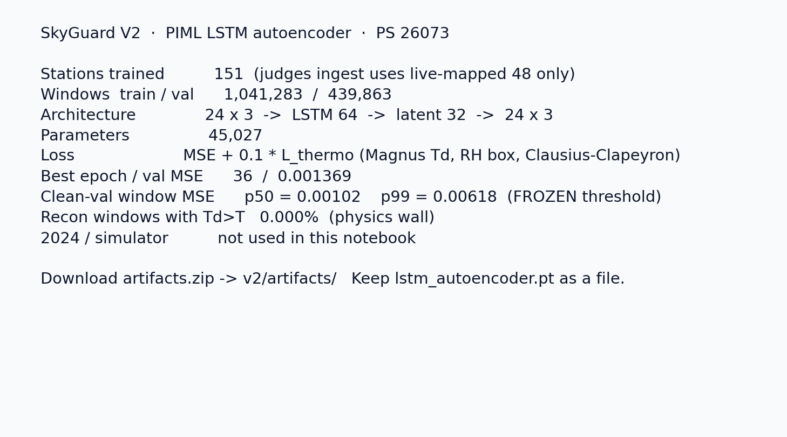
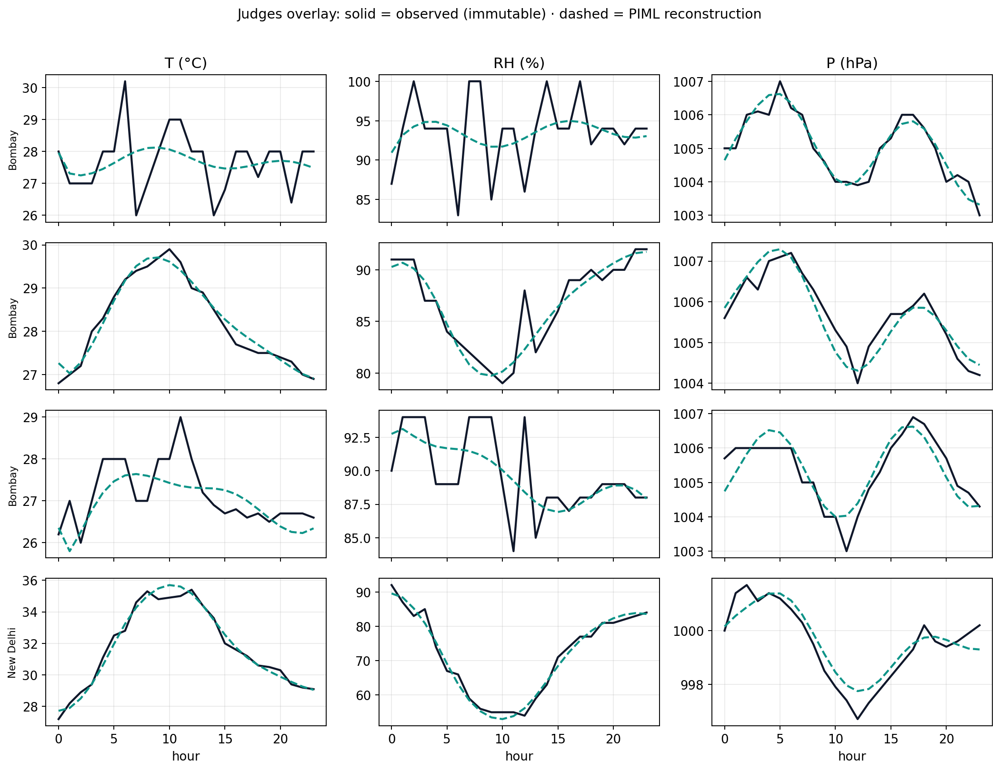
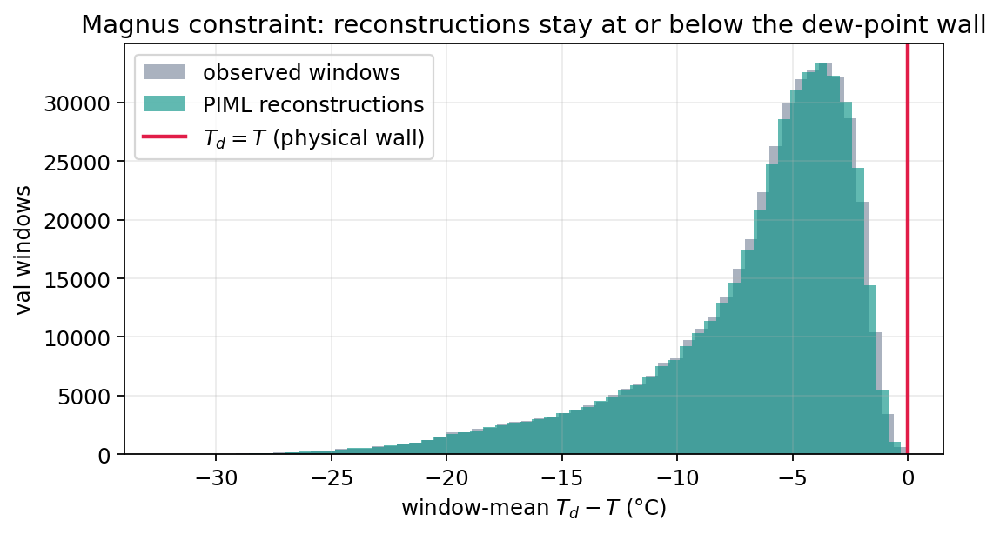

# SkyGuard V2

Software-only QC for Indian AWS (SIH 2026 **PS 26073**, MoES / IMD).  
Input is hourly **temperature, relative humidity, pressure**. Output is a five-way verdict, a corrected last hour when the sensor is untrusted, and a sentence an operator can read.

This folder is the **team deliverable**: runtime, frozen weights, catalogs, demo windows, and the I/O contract. Notebooks, Kaggle zips, IMD probes, and `_build_*.py` are not here.

**Teammates start here:** [`docs/CONTRACT.md`](docs/CONTRACT.md) — exact input JSON, exact output JSON, overlay, TIMING, what to draw.

---

## Why this stack

The official example is the product: **55 °C at one station, neighbors normal → hardware, not a heatwave.**

Clean 2020–2023 archives **cannot** teach that split. They teach climatology and T–RH–P physics. Faults in eval are **injected** (PS-legal). So:

| Model | Trained to do | Not trained to do |
|---|---|---|
| PIML LSTM-AE | Reconstruct a clean 24×3 window; Magnus dew-point wall in the loss | Find freeze (it reconstructs a stuck sensor too well) |
| CW-IDW (ingest) | Weather vs hardware on the **official** seed-42 injector | — |
| GAT (demo only) | Same decision on a **+8 °C spatial** injector (2023 gates passed) | Official SPIKE recipe (over-agreed; parked for ingest) |
| Last-hour Gaussian | One-pass μ,σ for a **distrusted** last hour | Rewrite a monsoon (overlay off on weather) |

Reconstruction GAT and CSDI-DDIM were trained, gated, and **left off the hot path**. Shipping a dead paper model is worse than an honest prior.

---

## Architecture

```text
24h T/P/H window + buddy windows (±1 h, 100 km)
        │
        ▼
[T1] Hard QC     missing, range, step, freeze (12 h / 2-of-3×6 h), Td > T
        │ fail hard → PHYSICAL_FAULT (confidence 1)
        │ STEP/RANGE is “soft”: still ask neighbors
        ▼
[T2] PIML LSTM   score s = 0.7·MSE(last 3 h) + 0.3·MSE(24 h)
                 vs frozen 2023 p99 of s = 0.008487
        │ s below threshold → CLEAN
        ▼
[T3] Spatial     CW-IDW  w ∝ exp(corr/τ) / d²
                 agree bands 3 °C / 8 % / 2 hPa, min 2 buddies
        │ neighbors agree → GENUINE_WEATHER_EVENT
        │ disagree      → HARDWARE_ANOMALY
        │ <2 usable     → UNCONFIRMED_ANOMALY
        ▼
Overlay          HARDWARE / PHYSICAL only
                 Gaussian μ ± 1.64σ  (90% band)
                 CLEAN / WEATHER copy observed; band null

XAI ingest       reason + physics + contribution bars + neighbor table
XAI async        TIMING (IG on LSTM score); first JSON timing=null
Health           7-day flag rate; weather does not count
```

Five labels: `CLEAN` | `PHYSICAL_FAULT` | `GENUINE_WEATHER_EVENT` | `HARDWARE_ANOMALY` | `UNCONFIRMED_ANOMALY`.

Raw is **never** overwritten. Weather is **amber** and does **not** drop health.

**Live inference:** 48 IMD-mapped stations (`v2/data/stations_judge48.csv`). Palam `42181` is not in that 48; Safdarjung `42182` is. **Train:** 151 stations, 2020–2022; val 2023; **2024 never used to pick thresholds.**

---

## Scoring vs SIH criteria

Weights from the problem statement. What we actually ship:

| Criterion | Weight | What we show | Evidence |
|---|---|---|---|
| Innovation | 25% | Magnus / Clausius wall in the AE; CW-IDW (correlation × inverse-distance²); task-trained GAT for the Mumbai 2 vs 3 story; Gaussian overlay instead of DDIM | Physics plot; `tier3.method`; demo GAT; overlay band ~25 °C on a 55 °C spike |
| Accuracy | 20% | Rules catch freeze/comms; last-hour-weighted LSTM cuts clean FPR; spatial head splits spike vs storm | Seed-42 48-station table below vs V1 |
| Real-time | 15% | One CPU forward (LSTM + IDW + optional 1-pass overlay). No diffusion loop | p50 **14 ms**, p95 **39 ms** |
| XAI | 10% | `reason`, Td−T, last-hour bars, neighbor mix/corr, TIMING hour-of-window | CONTRACT §7.4 |
| Scale | 10% | 151 train scalers; 48 live; unknown id refused (HTTP 400) | `scalers.json`, judge48 catalog |
| Deploy | 10% | In-process `process_aws_data`; optional FastAPI 8001; CPU | this folder |
| UI | 5% | Solid raw, dashed overlay only on hardware, weather amber, health 7d | CONTRACT §5–7 |
| Energy | 5% | Measured ingest ms (software category). No ESP32 | p95 39 ms |

---

## Numbers (locked)

**V1 LSTM-only** (same injector family, for contrast): freeze **6%**, drift 0.8%, spike 94%, clean FPR **60%**, F1 ~0.15.

**V2 seed-42, 48 live stations, stride 24 h, 16 798 windows, CW-IDW** (`v2/reports` in the research tree; threshold 0.008487):

| Family | Recall / rate |
|---|---|
| SPIKE → hardware/physical | **98.5%** |
| STORM → weather | **89.7%** |
| FREEZE | **100%** |
| COMMUNICATION | **100%** |
| DRIFT | 2.7% (known miss; last-hour score barely moves) |
| Clean FPR | **32.5%** (was 60%) |

GAT on that **same** official SPIKE injector dropped spike recall to 41% (it was trained on +8 °C shared-vs-singleton, not the official SPIKE recipe). Ingest therefore stays CW-IDW. GAT stays on `python -m v2.demo_engine` for the Mumbai hardware vs weather story (2023 gates: hardware disagree 0.998, weather agree 0.998, clean agree 0.966).

**Overlay (2023 val, scaled MAE):** T 0.0175, RH 0.0345, P 0.0106 (gates T < 0.03, RH < 0.05, P < 0.03). 90% coverage ~91–92%. On the 55 °C story: overlay **~25.2 °C**, band **24.2–26.3**.

**LSTM:** 24×3 → hidden 64 → latent 32, physics penalty λ=0.1. Train 2020–2022 (1.04M windows), val 2023. Ingest score uses last-3-hour weight, not raw 24 h MSE.







---

## Folder

```text
v2-deliverable/
  README.md                 this file
  requirements.txt
  docs/
    CONTRACT.md             backend + frontend I/O (read this)
    examples/               captured request/response JSON
    assets/                 plots for slides
  v2/                       Python package
    engine.py               process_aws_data
    main.py                 optional FastAPI
    demo_engine.py          six stories
    artifacts/              frozen .pt + scalers + p99
    data/
      stations.csv          151 catalog
      stations_judge48.csv  live 48
      buddy_edges.csv       100 km graph
      demo_windows.json     24 h for Mumbai four + Safdarjung
```

Nothing else is required to call ML or play the demo.

---

## Run

```text
cd v2-deliverable
pip install -r requirements.txt

# six stories (GAT on for 2 vs 3; overlay + TIMING poll)
python -m v2.demo_engine

# optional HTTP (CW-IDW ingest, TIMING poll)
uvicorn v2.main:app --port 8001
```

Product backend: `from v2.engine import process_aws_data` — see CONTRACT §1.

Windows: this package imports **torch before numpy** (`v2/__init__.py`) so `c10.dll` can load.

---

## What we refuse

- Overwriting observations with the overlay
- Coloring weather red / letting weather drop health
- Palam as a live station
- Thresholds fit on 2024
- CSDI / recon-GAT on `/ingest`
- ESP32 / TFLite (wrong category)
- Borrowing another station’s scaler for an unknown id
